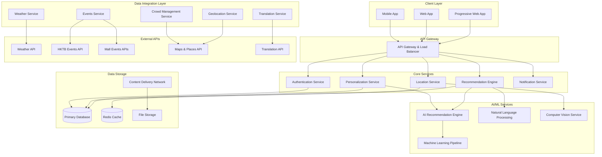

# Design Document

## Overview

The Hong Kong AI Tourism Platform is a comprehensive mobile and web application that leverages artificial intelligence, real-time data integration, and location-based services to provide personalized, culturally-aware tourism experiences. The platform addresses the Hong Kong Tourism Board's key challenges by transforming Hong Kong from a "stopover" to a "destination" through hyper-personalized recommendations, crowd management, authentic local experiences, and practical cultural guidance.

The system integrates multiple data sources including weather APIs, official tourism events, local business information, crowd density data, and community-generated content to create a dynamic, context-aware tourism assistant that adapts to real-time conditions and user preferences.

## Architecture

### High-Level Architecture



### Technology Stack

**Frontend:**
- React Native for mobile applications (iOS/Android)
- React.js for web application
- Progressive Web App capabilities for offline functionality
- Real-time location tracking and geofencing

**Backend:**
- Node.js with Express.js for API services
- Python with FastAPI for AI/ML services
- Microservices architecture with Docker containers
- Kubernetes for orchestration and scaling

**AI/ML:**
- TensorFlow/PyTorch for recommendation algorithms
- OpenAI GPT for natural language processing and content generation
- Computer vision for image recognition and analysis
- Collaborative filtering and content-based recommendation systems

**Data Storage:**
- PostgreSQL for primary data storage
- Redis for caching and session management
- MongoDB for content and user-generated data
- AWS S3 for media and file storage

**External Integrations:**
- Weather APIs (OpenWeatherMap, AccuWeather)
- Google Maps Platform for location services
- Hong Kong Tourism Board official data feeds
- Mall and venue event APIs
- Translation services (Google Translate API)

## Components and Interfaces

### 1. User Management Component

**Purpose:** Handle user authentication, preferences, and profile management

**Key Interfaces:**
- `UserService`: User registration, authentication, profile management
- `PreferenceService`: Store and retrieve user preferences and interests
- `PrivacyService`: Manage data privacy and consent settings

**Data Models:**
```typescript
interface User {
  id: string;
  email: string;
  preferences: UserPreferences;
  travelHistory: TravelRecord[];
  language: string;
  accessibilityNeeds: AccessibilityRequirements;
}

interface UserPreferences {
  interests: string[];
  budgetRange: BudgetRange;
  groupType: GroupType;
  dietaryRestrictions: string[];
  activityLevel: ActivityLevel;
}
```

### 2. Personalization Engine

**Purpose:** Generate personalized recommendations based on user preferences, context, and AI analysis

**Key Interfaces:**
- `RecommendationService`: Generate personalized itineraries and suggestions
- `ContextAnalyzer`: Analyze current context (weather, location, time, events)
- `PreferenceEngine`: Learn and adapt to user behavior patterns

**Core Algorithms:**
- Collaborative filtering for user similarity matching
- Content-based filtering for interest alignment
- Contextual bandits for real-time optimization
- Deep learning models for preference prediction

### 3. Location Intelligence System

**Purpose:** Provide location-based contextual information and tour guide functionality

**Key Interfaces:**
- `LocationService`: Track user location and trigger contextual content
- `GeofenceManager`: Manage location-based triggers and notifications
- `ContextualContentService`: Deliver relevant historical and cultural information
- `SafetyAdvisorService`: Provide location-specific safety and etiquette tips

**Features:**
- Real-time location tracking with privacy controls
- Geofenced content delivery
- Offline content caching for poor connectivity areas
- Multi-language content support

### 4. Real-Time Data Integration Hub

**Purpose:** Aggregate and process real-time data from multiple sources

**Key Interfaces:**
- `WeatherService`: Integrate weather data and provide activity recommendations
- `EventsService`: Aggregate events from HKTB, malls, and local venues
- `CrowdService`: Monitor and predict crowd levels at attractions
- `TransportService`: Provide real-time transportation information

**Data Sources:**
- Weather APIs for current conditions and forecasts
- Hong Kong Tourism Board event feeds
- Mall and shopping center event APIs
- Social media and review platforms for crowd insights
- Public transportation APIs

### 5. Community and Local Insights Platform

**Purpose:** Integrate local perspectives and community-generated content

**Key Interfaces:**
- `LocalInsightsService`: Curate and deliver local resident perspectives
- `CommunityService`: Manage user-generated content and reviews
- `AuthenticityService`: Verify and rank content authenticity
- `CulturalBridgeService`: Provide cultural context and etiquette guidance

**Content Management:**
- Local resident verification system
- Content moderation and quality control
- Multi-perspective rating system (tourist vs. local views)
- Cultural sensitivity filtering

### 6. Smart Notification System

**Purpose:** Deliver timely, contextual notifications and updates

**Key Interfaces:**
- `NotificationService`: Send personalized notifications
- `AlertService`: Provide weather, crowd, and safety alerts
- `ReminderService`: Send activity and preparation reminders

**Notification Types:**
- Weather-based activity suggestions
- Crowd level alerts and alternatives
- Cultural etiquette reminders
- Event and activity notifications
- Safety and preparation tips

## Data Models

### Core Data Structures

```typescript
// Location and Attraction Models
interface Attraction {
  id: string;
  name: string;
  location: GeoLocation;
  categories: string[];
  description: string;
  localPerspective: LocalInsight;
  practicalTips: PracticalTip[];
  crowdData: CrowdInfo;
  weatherDependency: WeatherDependency;
}

interface LocalInsight {
  localRating: number;
  localReviews: LocalReview[];
  authenticityScore: number;
  localRecommendations: string[];
  culturalContext: string;
}

interface PracticalTip {
  category: TipCategory; // SAFETY, ETIQUETTE, PREPARATION, WEATHER
  content: string;
  conditions: string[];
  priority: Priority;
}

// Event and Activity Models
interface Event {
  id: string;
  title: string;
  description: string;
  location: GeoLocation;
  startTime: Date;
  endTime: Date;
  source: EventSource; // HKTB, MALL, COMMUNITY
  targetAudience: string[];
  weatherDependent: boolean;
}

// Recommendation Models
interface Recommendation {
  id: string;
  type: RecommendationType;
  content: RecommendationContent;
  personalizedScore: number;
  contextualFactors: ContextualFactor[];
  practicalConsiderations: PracticalConsideration[];
}

interface ContextualFactor {
  type: string; // WEATHER, CROWD, TIME, LOCATION
  value: any;
  impact: number;
}
```

## Error Handling

### Error Categories and Strategies

**1. External API Failures**
- Implement circuit breaker patterns for external API calls
- Provide cached fallback data when APIs are unavailable
- Graceful degradation of features when data sources fail

**2. Location Services Errors**
- Handle GPS unavailability with manual location input
- Provide offline content for areas with poor connectivity
- Cache critical location-based content locally

**3. AI/ML Service Failures**
- Fallback to rule-based recommendations when AI services fail
- Maintain basic functionality without personalization
- Queue failed requests for retry when services recover

**4. Data Quality Issues**
- Implement data validation and sanitization pipelines
- Use confidence scores for AI-generated content
- Provide user feedback mechanisms for content quality

**Error Response Format:**
```typescript
interface ErrorResponse {
  error: {
    code: string;
    message: string;
    details?: any;
    fallbackAction?: string;
    retryAfter?: number;
  };
}
```

## Testing Strategy

### 1. Unit Testing
- Test individual components and services in isolation
- Mock external dependencies and APIs
- Achieve 90%+ code coverage for critical business logic
- Test AI/ML model accuracy and performance

### 2. Integration Testing
- Test API integrations with external services
- Validate data flow between microservices
- Test real-time data processing pipelines
- Verify location-based triggering accuracy

### 3. User Experience Testing
- Test personalization accuracy with diverse user profiles
- Validate location-based content delivery
- Test offline functionality and data synchronization
- Verify multi-language support and cultural sensitivity

### 4. Performance Testing
- Load testing for high tourist season traffic
- Test real-time recommendation generation speed
- Validate mobile app performance on various devices
- Test API response times under different conditions

### 5. Security Testing
- Test user data privacy and protection
- Validate authentication and authorization systems
- Test location data security and anonymization
- Verify compliance with data protection regulations

### 6. Accessibility Testing
- Test screen reader compatibility
- Validate keyboard navigation
- Test color contrast and visual accessibility
- Verify support for accessibility features

### Testing Tools and Frameworks
- Jest for JavaScript unit testing
- Pytest for Python AI/ML testing
- Cypress for end-to-end testing
- Postman for API testing
- Artillery for load testing
- Accessibility testing with axe-core