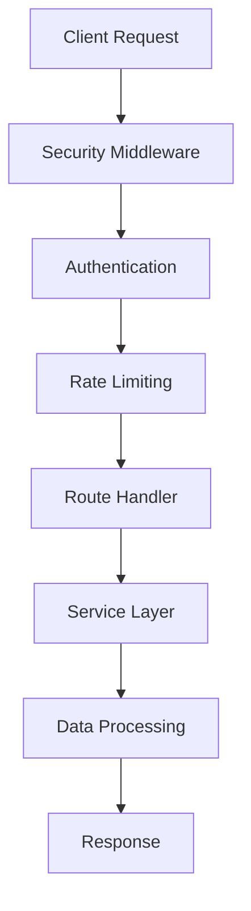

# Privacy Service

The Privacy Service is a comprehensive data privacy and security solution for the Hong Kong Tourism AI Platform. It provides GDPR-compliant consent management, data anonymization, secure authentication, and data protection features.

## 🔒 Features

### Consent Management
- **Granular Consent Control**: Manage user consent for different data usage types (location tracking, analytics, marketing, etc.)
- **Consent History**: Complete audit trail of all consent changes
- **Automatic Expiry**: Consent expires after configurable periods requiring renewal
- **Bulk Operations**: Update multiple consents simultaneously
- **GDPR Compliance**: Meets GDPR requirements for explicit consent

### Data Anonymization
- **User Data Anonymization**: Hash sensitive fields while preserving analytical utility
- **Location Data Protection**: Reduce location precision and add noise for crowd analytics
- **K-Anonymity**: Ensure datasets meet k-anonymity requirements
- **Differential Privacy**: Add statistical noise to protect individual privacy
- **Crowd Analytics**: Anonymize crowd data while maintaining insights

### GDPR Rights Management
- **Data Export**: Complete data export in multiple formats (JSON, CSV, XML)
- **Data Deletion**: Right to erasure with legal retention compliance
- **Data Portability**: Structured data export for user portability
- **Data Rectification**: Support for data correction requests
- **Verification System**: Email-based verification for sensitive requests

### Security & Authentication
- **JWT Authentication**: Secure token-based authentication
- **API Key Authentication**: Service-to-service authentication
- **Rate Limiting**: Multiple levels of rate limiting protection
- **Role-Based Access**: Admin and user role separation
- **Security Headers**: Comprehensive security headers via Helmet
- **Audit Logging**: Complete security event logging

## 🚀 Quick Start

### Prerequisites
- Node.js 18+
- npm or yarn
- TypeScript

### Installation

```bash
# Install dependencies
npm install

# Build the service
npm run build

# Run tests
npm test

# Start development server
npm run dev

# Start production server
npm start
```

### Environment Configuration

Copy `.env.example` to `.env` and configure:

```bash
# Basic Configuration
PORT=3007
NODE_ENV=production
JWT_SECRET=your-super-secret-jwt-key

# Security
VALID_API_KEYS=hashed-api-key-1,hashed-api-key-2
ALLOWED_ORIGINS=https://yourdomain.com

# Rate Limiting
RATE_LIMIT_WINDOW_MS=900000
RATE_LIMIT_MAX_REQUESTS=100
STRICT_RATE_LIMIT_MAX=5
```

## 📚 API Documentation

### Authentication

All endpoints require authentication via JWT token or API key:

```bash
# JWT Authentication
Authorization: Bearer <jwt-token>

# API Key Authentication
X-API-Key: <api-key>
```

### Consent Management

#### Record Consent
```http
POST /api/privacy/consent
Content-Type: application/json
Authorization: Bearer <token>

{
  "consentType": "location_tracking",
  "granted": true,
  "metadata": {
    "source": "mobile_app",
    "version": "1.0"
  }
}
```

#### Get Consent Profile
```http
GET /api/privacy/consent/profile
Authorization: Bearer <token>
```

#### Withdraw Consent
```http
DELETE /api/privacy/consent/location_tracking
Authorization: Bearer <token>
```

#### Bulk Consent Update
```http
POST /api/privacy/consent/bulk
Content-Type: application/json
Authorization: Bearer <token>

{
  "consents": [
    {
      "consentType": "location_tracking",
      "granted": true
    },
    {
      "consentType": "marketing",
      "granted": false
    }
  ]
}
```

### GDPR Rights

#### Submit Data Request
```http
POST /api/privacy/gdpr/request
Content-Type: application/json
Authorization: Bearer <token>

{
  "requestType": "data_export",
  "dataTypes": ["personal_data", "preferences"],
  "format": "json",
  "includeMetadata": true
}
```

#### Verify Data Request
```http
POST /api/privacy/gdpr/verify/{requestId}
Content-Type: application/json

{
  "token": "verification-token-from-email"
}
```

#### Check Request Status
```http
GET /api/privacy/gdpr/request/{requestId}
Authorization: Bearer <token>
```

#### Get Requests History
```http
GET /api/privacy/gdpr/requests
Authorization: Bearer <token>
```

### Data Anonymization (Admin Only)

#### Anonymize Data
```http
POST /api/privacy/anonymize
Content-Type: application/json
Authorization: Bearer <admin-token>

{
  "userData": {
    "user_id": "user123",
    "email": "user@example.com",
    "name": "John Doe",
    "age": 25
  }
}
```

## 🔧 Usage Examples

### JavaScript/TypeScript Client

```typescript
import axios from 'axios';

const privacyClient = axios.create({
  baseURL: 'http://localhost:3007/api/privacy',
  headers: {
    'Authorization': `Bearer ${userToken}`
  }
});

// Record consent
await privacyClient.post('/consent', {
  consentType: 'location_tracking',
  granted: true
});

// Get consent profile
const profile = await privacyClient.get('/consent/profile');

// Submit GDPR request
const request = await privacyClient.post('/gdpr/request', {
  requestType: 'data_export',
  dataTypes: ['personal_data', 'preferences'],
  format: 'json'
});
```

### Python Client

```python
import requests

class PrivacyClient:
    def __init__(self, base_url, token):
        self.base_url = base_url
        self.headers = {'Authorization': f'Bearer {token}'}
    
    def record_consent(self, consent_type, granted):
        return requests.post(
            f'{self.base_url}/consent',
            json={'consentType': consent_type, 'granted': granted},
            headers=self.headers
        )
    
    def get_consent_profile(self):
        return requests.get(
            f'{self.base_url}/consent/profile',
            headers=self.headers
        )

# Usage
client = PrivacyClient('http://localhost:3007/api/privacy', user_token)
client.record_consent('location_tracking', True)
```

## 🧪 Testing

### Run All Tests
```bash
npm test
```

### Run Specific Test Suites
```bash
# Consent service tests
npm test -- tests/services/consentService.test.ts

# GDPR service tests
npm test -- tests/services/gdprService.test.ts

# Security middleware tests
npm test -- tests/middleware/securityMiddleware.test.ts

# API route tests
npm test -- tests/routes/privacy.test.ts
```

### Test Coverage
```bash
npm test -- --coverage
```

### Demo
```bash
# Run the interactive demo
npm run demo
```

## 🏗️ Architecture

### Service Structure
```
privacy-service/
├── src/
│   ├── models/           # Data models and interfaces
│   ├── services/         # Business logic services
│   ├── middleware/       # Security and validation middleware
│   ├── routes/          # API route handlers
│   └── index.ts         # Application entry point
├── tests/               # Test suites
├── demo/               # Demo and examples
└── dist/               # Compiled JavaScript
```

### Key Components

1. **ConsentService**: Manages user consent records and preferences
2. **GDPRService**: Handles GDPR rights requests (export, deletion, portability)
3. **AnonymizationService**: Provides data anonymization and privacy protection
4. **SecurityMiddleware**: Implements authentication, authorization, and rate limiting

### Data Flow



## 🔐 Security Features

### Authentication & Authorization
- JWT token validation
- API key authentication for services
- Role-based access control
- Token expiration handling

### Rate Limiting
- IP-based rate limiting
- User-based rate limiting
- Strict limits for sensitive endpoints
- Configurable windows and thresholds

### Data Protection
- Input validation and sanitization
- SQL injection prevention
- XSS protection via security headers
- CSRF protection
- Secure cookie handling

### Privacy Protection
- Data minimization principles
- Purpose limitation
- Storage limitation
- Accuracy maintenance
- Integrity and confidentiality

## 📊 Monitoring & Logging

### Audit Logging
All security-relevant events are logged:
- Authentication attempts
- Consent changes
- GDPR requests
- Data access
- Rate limit violations

### Health Monitoring
```http
GET /health
```

Returns service health status and metrics.

### Metrics
- Request rates
- Error rates
- Response times
- Active users
- Consent statistics

## 🚀 Deployment

### Docker
```bash
# Build image
docker build -t privacy-service .

# Run container
docker run -p 3007:3007 -e JWT_SECRET=your-secret privacy-service
```

### Docker Compose
```yaml
privacy-service:
  build: ./backend/services/privacy-service
  ports:
    - "3007:3007"
  environment:
    - NODE_ENV=production
    - JWT_SECRET=your-jwt-secret
    - VALID_API_KEYS=your-api-keys
```

### Production Considerations
- Use strong JWT secrets
- Configure proper CORS origins
- Set up SSL/TLS termination
- Configure rate limiting appropriately
- Set up monitoring and alerting
- Regular security audits
- Data backup and recovery

## 🤝 Integration

### With Other Services

The privacy service integrates with other platform services:

```typescript
// User Service Integration
const userConsent = await privacyService.hasConsent(userId, 'location_tracking');
if (userConsent) {
  // Proceed with location tracking
}

// Analytics Service Integration
const anonymizedData = await privacyService.anonymizeUserData(userData);
await analyticsService.recordEvent(anonymizedData);

// Notification Service Integration
const marketingConsent = await privacyService.hasConsent(userId, 'marketing');
if (marketingConsent) {
  await notificationService.sendMarketingEmail(userId);
}
```

## 📋 Compliance

### GDPR Compliance
- ✅ Lawful basis for processing
- ✅ Consent management
- ✅ Right to access
- ✅ Right to rectification
- ✅ Right to erasure
- ✅ Right to restrict processing
- ✅ Right to data portability
- ✅ Data protection by design
- ✅ Data protection impact assessments

### Security Standards
- ✅ OWASP Top 10 protection
- ✅ Data encryption in transit
- ✅ Secure authentication
- ✅ Input validation
- ✅ Rate limiting
- ✅ Audit logging
- ✅ Error handling

## 🆘 Support

### Common Issues

**Q: JWT token expired errors**
A: Implement token refresh logic in your client application.

**Q: Rate limit exceeded**
A: Implement exponential backoff in your client or request rate limit increase.

**Q: GDPR request verification fails**
A: Check email delivery and ensure verification tokens haven't expired (24h limit).

### Debugging

Enable debug logging:
```bash
LOG_LEVEL=debug npm start
```

Check service health:
```bash
curl http://localhost:3007/health
```

## 📄 License

This service is part of the Hong Kong Tourism AI Platform and follows the project's licensing terms.

## 🔄 Changelog

### v1.0.0
- Initial release
- Consent management system
- GDPR compliance features
- Data anonymization
- Security middleware
- Comprehensive test suite